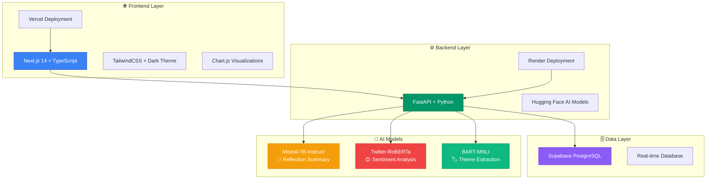
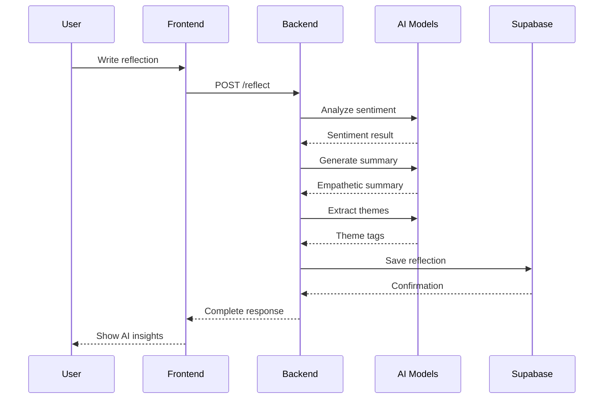
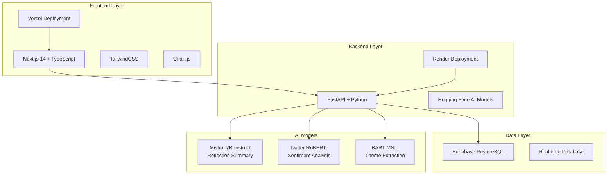

<div align="center">

# 🌟 Mirror AI - The AI Reflection System

[](https://mirror-ai-pink.vercel.app)
[](https://mirror-ai-pa9g.onrender.com/docs)
[](https://github.com/MhussainD4772/Mirror-AI/releases/tag/v1.0.0)
[](LICENSE)

*A mobile-friendly web application that helps users reflect on their day through AI-powered emotional analysis and empathetic insights.*

[](https://nextjs.org/)
[](https://fastapi.tiangolo.com/)
[](https://supabase.com/)
[](https://tailwindcss.com/)

</div>

---

## 🎯 **What is Mirror AI?**

<div align="center">


*Mirror AI acts as your personal reflection companion, using AI to analyze emotions, generate empathetic summaries, and track your emotional journey over time.*

</div>

### ✨ **Key Features**

<table>
<tr>
<td width="50%">

#### 🧠 **AI-Powered Analysis**
- **Sentiment Detection**: Positive, negative, or neutral emotions
- **Empathetic Summaries**: Personalized insights with actionable suggestions  
- **Theme Extraction**: Identifies recurring patterns and topics
- **Real-time Processing**: Instant analysis using Hugging Face AI models

</td>
<td width="50%">

#### 📊 **Interactive Dashboard**
- **Mood Trends**: Visualize your emotional journey over time
- **Tag Frequency**: See which themes appear most in your reflections
- **Statistics**: Track total reflections, positive days, and unique themes
- **Responsive Charts**: Interactive visualizations for all devices

</td>
</tr>
<tr>
<td width="50%">

#### 🎨 **Beautiful Experience**
- **Dark Mode**: Calm, reflective interface for introspection
- **Mobile-First**: Fully responsive design optimized for mobile
- **Mood Picker**: Quick emoji-based mood selection (🙂 😐 🙁)
- **Real-time Updates**: Instant feedback and state management

</td>
<td width="50%">

#### 🔒 **Privacy & Security**
- **Secure Storage**: Your reflections stored safely in Supabase
- **Free AI Models**: Uses open-source Hugging Face models
- **HTTPS Everywhere**: Secure connections across all services
- **No Data Collection**: Your privacy is protected

</td>
</tr>
</table>

---

## 🚀 **Live Demo**

<div align="center">

### 🌐 **Try Mirror AI Now!**

[](https://mirror-ai-pink.vercel.app)

**Frontend**: [https://mirror-ai-pink.vercel.app](https://mirror-ai-pink.vercel.app)  
**Backend API**: [https://mirror-ai-pa9g.onrender.com](https://mirror-ai-pa9g.onrender.com)  
**API Documentation**: [https://mirror-ai-pa9g.onrender.com/docs](https://mirror-ai-pa9g.onrender.com/docs)

</div>

---

## 🏗️ **Architecture**

<div align="center">



</div>

---

## 🛠️ **Tech Stack**

<table>
<tr>
<td width="33%" align="center">

### 🎨 **Frontend**
- **Next.js 14** - React framework
- **TypeScript** - Type safety
- **TailwindCSS** - Styling
- **Chart.js** - Data visualization
- **Vercel** - Deployment

</td>
<td width="33%" align="center">

### ⚙️ **Backend**
- **FastAPI** - Python web framework
- **Python 3.11+** - Programming language
- **Hugging Face** - AI model inference
- **Render** - Deployment platform

</td>
<td width="33%" align="center">

### 🗄️ **Database & AI**
- **Supabase** - PostgreSQL database
- **Mistral-7B** - Reflection summaries
- **RoBERTa** - Sentiment analysis
- **BART-MNLI** - Theme extraction

</td>
</tr>
</table>

---

## 🚀 **Quick Start**

### 📋 **Prerequisites**
- Python 3.11+
- Node.js 18+
- Git

### 🔧 **Local Development**

<details>
<summary><b>Click to expand setup instructions</b></summary>

```bash
# 1. Clone the repository
git clone https://github.com/MhussainD4772/Mirror-AI.git
cd Mirror-AI

# 2. Setup Backend
cd backend
python -m venv venv
source venv/bin/activate  # On Windows: venv\Scripts\activate
pip install -r requirements.txt

# 3. Setup Frontend
cd ../frontend
npm install

# 4. Environment Variables
# Create .env in project root with:
SUPABASE_URL=your_supabase_url
SUPABASE_ANON_KEY=your_supabase_key
HF_TOKEN=your_huggingface_token

# Create .env.local in frontend with:
NEXT_PUBLIC_BACKEND_URL=http://localhost:8000

# 5. Run Development Servers
# Terminal 1 - Backend
cd backend && source ../venv/bin/activate
uvicorn main:app --reload

# Terminal 2 - Frontend  
cd frontend
npm run dev
```

**Frontend**: http://localhost:3000  
**Backend**: http://localhost:8000

</details>

---

## 📱 **Screenshots**

<div align="center">

<table>
<tr>
<td align="center">

### 🏠 **Home Page**


*Clean interface for daily reflections*

</td>
<td align="center">

### 📊 **Dashboard**


*Interactive charts and insights*

</td>
<td align="center">

### 📱 **Mobile View**


*Perfect on all devices*

</td>
</tr>
</table>

</div>

---

## 🧪 **Testing**

<div align="center">

### ✅ **Test Checklist**

| Component | Status | Description |
|-----------|--------|-------------|
| 🎨 Frontend | ✅ | Next.js app loads and renders |
| ⚙️ Backend | ✅ | FastAPI serves requests |
| 🤖 AI Models | ✅ | Sentiment, summary, tags working |
| 🗄️ Database | ✅ | Supabase integration active |
| 📱 Mobile | ✅ | Responsive design verified |
| 🔗 Integration | ✅ | End-to-end flow working |

</div>

---

## 🌟 **Features in Action**

<div align="center">

### 🎯 **How It Works**



</div>

---

## 🚀 **Deployment**

### ☁️ **Production URLs**
- **Frontend**: [https://mirror-ai-pink.vercel.app](https://mirror-ai-pink.vercel.app)
- **Backend**: [https://mirror-ai-pa9g.onrender.com](https://mirror-ai-pa9g.onrender.com)
- **API Docs**: [https://mirror-ai-pa9g.onrender.com/docs](https://mirror-ai-pa9g.onrender.com/docs)

### 🛠️ **Deployment Platforms**
- **Frontend**: Vercel (Free Tier)
- **Backend**: Render (Free Tier)
- **Database**: Supabase (Free Tier)

---

## 💡 **AI Philosophy**

<div align="center">

> *"Mirror's AI listens, understands, and reflects your day in real-time. It's designed to be your empathetic companion, providing gentle insights and actionable suggestions without judgment. The system combines advanced NLP models to analyze sentiment, extract themes, and generate personalized summaries that help you understand your emotional patterns and grow as a person."*

</div>

---

## 🤝 **Contributing**

<div align="center">

### 🚀 **Want to contribute?**

1. **Fork** the repository
2. **Create** a feature branch (`git checkout -b feature/amazing-feature`)
3. **Commit** your changes (`git commit -m 'Add amazing feature'`)
4. **Push** to the branch (`git push origin feature/amazing-feature`)
5. **Open** a Pull Request

</div>

---

## 📄 **License**

<div align="center">

This project is licensed under the **MIT License** - see the [LICENSE](LICENSE) file for details.

[](https://opensource.org/licenses/MIT)

</div>

---

## 🙏 **Acknowledgments**

<div align="center">

- **Hugging Face** for providing free AI models
- **Supabase** for the database infrastructure
- **Vercel** and **Render** for hosting services
- **Next.js** and **FastAPI** communities

</div>

---

<div align="center">

### 🌟 **Star this repository if you found it helpful!**

[](https://github.com/MhussainD4772/Mirror-AI/stargazers)
[](https://github.com/MhussainD4772/Mirror-AI/network)

**Built with ❤️ by [MhussainD4772](https://github.com/MhussainD4772)**

</div>

## 🎯 Project Overview

Mirror AI acts as your personal reflection companion, using AI to:
- **Analyze emotions** from your daily reflections
- **Generate empathetic summaries** with actionable insights
- **Extract themes and patterns** from your thoughts
- **Track trends** over time for self-awareness
- **Provide gentle nudges** for personal growth

## 🧱 Tech Stack



### Frontend
- **Framework**: Next.js 14 (React, TypeScript)
- **Styling**: TailwindCSS
- **Charts**: react-chartjs-2 / Chart.js
- **Deployment**: Vercel Free Tier

### Backend
- **Language**: Python 3.11+
- **Framework**: FastAPI
- **Deployment**: Render Free Tier
- **Handles**: AI logic, API endpoints, Supabase communication

### Database & Auth
- **Database**: Supabase (Postgres Free Tier)
- **Table**: `entries` → stores text, summary, sentiment, tags, timestamps

### AI / NLP Models (Free on Hugging Face)
- **Reflection summary**: `mistralai/Mistral-7B-Instruct`
- **Sentiment analysis**: `cardiffnlp/twitter-roberta-base-sentiment-latest`
- **Theme extraction**: `facebook/bart-large-mnli`
- **Access**: Hugging Face Inference API (no paid key required)

## 🚀 Quick Start

### Prerequisites
- Python 3.11+
- Node.js 18+
- Git

### 1. Clone the Repository
```bash
git clone <your-repo-url>
cd mirror-ai
```

### 2. Frontend Setup & Run
```bash
# Install frontend dependencies
cd frontend
npm install

# Create environment file
echo "NEXT_PUBLIC_BACKEND_URL=http://127.0.0.1:8000" > .env.local

# Start frontend development server
npm run dev
```
**Frontend will be available at:** http://localhost:3000

### 3. Backend Setup & Run
```bash
# Install backend dependencies
cd backend
source ../venv/bin/activate
pip install -r requirements.txt

# Start backend server
uvicorn main:app --host 0.0.0.0 --port 8000 --reload
```
**Backend API will be available at:** http://localhost:8000

### 4. Test the Integration
1. **Visit Frontend**: http://localhost:3000
2. **Add a Reflection**: Use the form to submit a reflection
3. **View Dashboard**: Click "Dashboard" to see charts and insights
4. **Verify API**: Check http://localhost:8000/docs for API documentation

## ☁️ Production Deployment

### Deploy Backend to Render

1. **Push to GitHub**:
   ```bash
   git add .
   git commit -m "Prepare for production deployment"
   git push origin main
   ```

2. **Create Render Web Service**:
   - Go to [render.com](https://render.com) and create account
   - Click "New" → "Web Service"
   - Connect your GitHub repository
   - Set **Root Directory**: `backend`
   - Set **Build Command**: `pip install -r requirements.txt`
   - Set **Start Command**: `gunicorn main:app -w 4 -k uvicorn.workers.UvicornWorker --bind 0.0.0.0:$PORT`

3. **Add Environment Variables** in Render dashboard:
   ```
   SUPABASE_URL=https://gujocpadyrtyixmdbtdr.supabase.co
   SUPABASE_ANON_KEY=your_supabase_anon_key_here
   HF_TOKEN=your_huggingface_token_here
   PYTHON_ENV=production
   ```

4. **Deploy**: Click "Create Web Service" and wait for deployment

### Deploy Frontend to Vercel

1. **Create Vercel Project**:
   - Go to [vercel.com](https://vercel.com) and create account
   - Click "New Project" → Import from GitHub
   - Select your repository
   - Set **Root Directory**: `frontend`

2. **Add Environment Variables** in Vercel dashboard:
   ```
   NEXT_PUBLIC_BACKEND_URL=https://your-backend-name.onrender.com
   ```

3. **Deploy**: Click "Deploy" and wait for deployment

### Verify Production Deployment

1. **Test Backend**: Visit `https://your-backend-name.onrender.com/docs`
2. **Test Frontend**: Visit your Vercel URL
3. **Test Integration**: Submit a reflection and verify it saves to Supabase
4. **Test Mobile**: Check responsive design on mobile devices

## ✨ Features

### 🧠 AI-Powered Analysis
- **Sentiment Analysis**: Detects positive, negative, or neutral emotions
- **Empathetic Summaries**: Generates personalized insights with actionable suggestions
- **Theme Extraction**: Identifies recurring patterns and topics in your reflections
- **Real-time Processing**: Instant analysis using Hugging Face AI models

### 📊 Dashboard & Insights
- **Mood Trends**: Visualize your emotional journey over time
- **Tag Frequency**: See which themes appear most in your reflections
- **Statistics**: Track total reflections, positive days, and unique themes
- **Responsive Charts**: Interactive visualizations that work on all devices

### 🎨 User Experience
- **Dark Mode**: Calm, reflective interface designed for introspection
- **Mobile-First**: Fully responsive design optimized for mobile devices
- **Mood Picker**: Quick emoji-based mood selection (🙂 😐 🙁)
- **Real-time Updates**: Instant feedback and state management
- **Error Handling**: Graceful error states and loading indicators

### 🔒 Privacy & Security
- **No Data Collection**: Your reflections are stored securely in Supabase
- **Free AI Models**: Uses open-source Hugging Face models
- **HTTPS Everywhere**: Secure connections across all services
- **CORS Protection**: Proper cross-origin resource sharing configuration

## 🧪 Testing Checklist

### ✅ Backend Testing
- [ ] `/reflect` endpoint returns JSON with summary/sentiment/tags
- [ ] Supabase table `entries` receives new records
- [ ] Hugging Face API integration works correctly
- [ ] CORS headers allow frontend requests
- [ ] Error handling for API failures

### ✅ Frontend Testing
- [ ] Reflection form submits successfully
- [ ] Dashboard charts populate correctly
- [ ] Mobile layout is readable and scroll-safe
- [ ] Dark mode is readable on OLED screens
- [ ] Loading states work properly
- [ ] Error messages display correctly

### ✅ Integration Testing
- [ ] End-to-end reflection flow works
- [ ] Data persists between sessions
- [ ] Charts update with new data
- [ ] Mobile responsiveness verified
- [ ] Production URLs accessible

### 5. Set Up Environment Variables
```bash
# Copy the example environment file
cp env.example .env

# Edit .env with your credentials
nano .env
```

Required environment variables:
```env
# Supabase Configuration
SUPABASE_URL=your_supabase_project_url
SUPABASE_ANON_KEY=your_supabase_anon_key
SUPABASE_SERVICE_ROLE_KEY=your_supabase_service_role_key

# Hugging Face API
HUGGINGFACE_API_KEY=your_huggingface_api_key

# Backend Configuration
BACKEND_URL=http://localhost:8000
FRONTEND_URL=http://localhost:3000
```

### 3. Install Dependencies
```bash
# Install Python dependencies
pip install -r backend/requirements.txt

# Install Node.js dependencies
cd frontend
npm install
cd ..
```

### 4. Set Up Supabase Database
1. Create a new project at [supabase.com](https://supabase.com)
2. Go to SQL Editor and run this query:

```sql
-- Create entries table
CREATE TABLE entries (
    id UUID DEFAULT gen_random_uuid() PRIMARY KEY,
    user_id TEXT NOT NULL DEFAULT 'default_user',
    text TEXT NOT NULL,
    summary TEXT NOT NULL,
    sentiment TEXT NOT NULL CHECK (sentiment IN ('positive', 'negative', 'neutral')),
    tags TEXT[] DEFAULT '{}',
    created_at TIMESTAMP WITH TIME ZONE DEFAULT NOW()
);

-- Create indexes for better performance
CREATE INDEX idx_entries_user_id ON entries(user_id);
CREATE INDEX idx_entries_created_at ON entries(created_at);
CREATE INDEX idx_entries_sentiment ON entries(sentiment);

-- Enable Row Level Security (optional)
ALTER TABLE entries ENABLE ROW LEVEL SECURITY;

-- Create policy for user data access
CREATE POLICY "Users can access their own entries" ON entries
    FOR ALL USING (user_id = current_setting('request.jwt.claims', true)::json->>'sub');
```

### 5. Get Hugging Face API Key
1. Sign up at [huggingface.co](https://huggingface.co)
2. Go to Settings → Access Tokens
3. Create a new token (no payment required)
4. Add it to your `.env` file

### 6. Run the Application

#### Start the Backend
```bash
cd backend
python main.py
```
Backend will be available at `http://localhost:8000`

#### Start the Frontend
```bash
cd frontend
npm run dev
```
Frontend will be available at `http://localhost:3000`

## 📱 Features

### Core Functionality
- **Daily Reflection Input**: Write or speak your thoughts
- **AI Emotional Analysis**: Sentiment detection and theme extraction
- **Empathetic Summaries**: AI-generated insights with actionable suggestions
- **Trend Tracking**: Visual charts showing mood patterns and recurring themes
- **Mobile-First Design**: Responsive UI optimized for mobile devices

### Dashboard Features
- **Mood Trends**: Line chart showing emotional patterns over time
- **Theme Analysis**: Bar chart of most common reflection topics
- **Sentiment Distribution**: Doughnut chart of positive/negative/neutral breakdown
- **Statistics**: Total entries, streak days, weekly averages
- **AI Insights**: Personalized recommendations based on patterns

## 🚀 Deployment

### Backend Deployment (Render)

1. **Prepare for Deployment**
   ```bash
   # Create a Procfile in the backend directory
   echo "web: uvicorn main:app --host 0.0.0.0 --port \$PORT" > backend/Procfile
   ```

2. **Deploy to Render**
   - Go to [render.com](https://render.com)
   - Create a new Web Service
   - Connect your GitHub repository
   - Set build command: `pip install -r backend/requirements.txt`
   - Set start command: `uvicorn main:app --host 0.0.0.0 --port $PORT`
   - Add environment variables from your `.env` file

### Frontend Deployment (Vercel)

1. **Deploy to Vercel**
   - Go to [vercel.com](https://vercel.com)
   - Import your GitHub repository
   - Set root directory to `frontend`
   - Add environment variables:
     - `NEXT_PUBLIC_API_URL`: Your Render backend URL

2. **Update CORS Settings**
   - In your backend `main.py`, update the CORS origins:
   ```python
   app.add_middleware(
       CORSMiddleware,
       allow_origins=["https://your-vercel-app.vercel.app"],
       allow_credentials=True,
       allow_methods=["*"],
       allow_headers=["*"],
   )
   ```

### Database Setup (Supabase)

1. **Production Database**
   - Use the same Supabase project for production
   - Update environment variables with production URLs
   - Ensure RLS policies are properly configured

## 🔧 API Endpoints

### Reflection Processing
- `POST /api/reflect` - Process a new reflection
- `GET /api/reflect/{entry_id}` - Get specific reflection

### Data Retrieval
- `GET /api/entries` - Get user's reflection entries
- `GET /api/entries/stats` - Get aggregated statistics
- `GET /api/entries/trends` - Get trend analysis
- `DELETE /api/entries/{entry_id}` - Delete reflection

### Health Check
- `GET /health` - Service health status

## 🧠 AI Models & Prompts

### Reflection Summary (Mistral-7B-Instruct)
```
You are a personal reflection AI that helps people understand their emotions and experiences.

User's reflection: "{text}"
Detected sentiment: {sentiment}

Please provide a 2-3 sentence empathetic summary that:
1. Acknowledges their feelings with compassion
2. Offers gentle insight about their experience
3. Ends with a gentle, actionable suggestion for tomorrow

Be warm, understanding, and supportive. Avoid clinical language.
```

### Sentiment Analysis (twitter-roberta-base-sentiment-latest)
- Automatically detects positive, negative, or neutral sentiment
- Fallback to keyword-based analysis if API fails

### Theme Extraction (BART-large-MNLI)
- Zero-shot classification against 15 common life themes
- Fallback to keyword matching for reliability

## 🛠️ Development

### Project Structure
```
mirror-ai/
├── backend/
│   ├── main.py                 # FastAPI entry point
│   ├── routes/
│   │   ├── reflect.py         # Reflection processing routes
│   │   └── entries.py         # Data retrieval routes
│   ├── services/
│   │   ├── reflection_ai.py   # Mistral AI service
│   │   ├── sentiment.py       # Sentiment analysis
│   │   └── tagging.py         # Theme extraction
│   ├── supabase_client.py     # Database operations
│   └── requirements.txt       # Python dependencies
├── frontend/
│   ├── pages/
│   │   ├── index.tsx          # Home page with reflection form
│   │   ├── dashboard.tsx      # Analytics dashboard
│   │   └── _app.tsx           # App configuration
│   ├── components/
│   │   ├── ReflectionForm.tsx # Input form component
│   │   ├── ReflectionCard.tsx # Individual reflection display
│   │   └── ChartSection.tsx   # Charts and analytics
│   ├── utils/
│   │   └── apiClient.ts       # API client utilities
│   ├── styles/
│   │   └── globals.css        # Global styles
│   └── package.json           # Node.js dependencies
└── env.example                # Environment template
```

### Running Tests
```bash
# Backend tests
cd backend
python -m pytest

# Frontend tests
cd frontend
npm test
```

### Code Quality
```bash
# Backend linting
cd backend
black .
flake8 .

# Frontend linting
cd frontend
npm run lint
```

## 🔒 Privacy & Security

- **Data Privacy**: All reflections are stored securely in Supabase
- **No Data Sharing**: Your personal reflections are never shared
- **Local Processing**: AI analysis happens via secure API calls
- **User Control**: Delete your data anytime through the dashboard

## 🤝 Contributing

1. Fork the repository
2. Create a feature branch (`git checkout -b feature/amazing-feature`)
3. Commit your changes (`git commit -m 'Add amazing feature'`)
4. Push to the branch (`git push origin feature/amazing-feature`)
5. Open a Pull Request

## 📄 License

This project is licensed under the MIT License - see the [LICENSE](LICENSE) file for details.

## 🙏 Acknowledgments

- **Hugging Face** for providing free AI models
- **Supabase** for the database and authentication
- **Vercel** and **Render** for free hosting
- **TailwindCSS** for the beautiful UI framework

## 📞 Support

If you encounter any issues or have questions:

1. Check the [Issues](https://github.com/your-username/mirror-ai/issues) page
2. Create a new issue with detailed information
3. Join our community discussions

---

**Built with ❤️ for self-discovery and personal growth**
